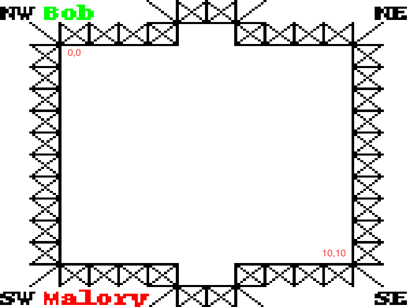
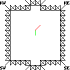
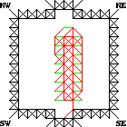
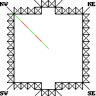
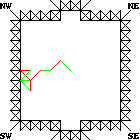

Welcome to Silicon Valley.

Here, chess is obsolete; therefore, people started playing a new kind of 1 vs 1 game...

It's called paper hockey.

---

# Paper Hockey

Paper Hockey is a turn-based game played on a `11x11` grid.

The game starts with a puck at the center of the grid, and the goal of the game is to take the puck into your opponent's net.

Goals are at the north and south boundaries of the grid (see the picture below).



---

## Rules:
 - Each turn, a player can throw the puck in one of 8 directions (N, S, W, E and diagonals)
 - The puck can't travel twice on the same segment - once the ice is crushed you can't go back.
 - Shooting the puck into a visited node or a wall results in a bounce, which allows the active player to make another move.
 - You have at most 2 seconds to send your move. Timing out means losing the game.
 - A game is won by scoring a goal or forcing the other player into checkmate (see `Checkmate` section).

---

## Goal example

1. Player 1 (green) moves north (towards his goal):


---

2. Player 2 (red) moves north east (a dumb move):



---

3. Player 1 (green) moves north.
4. Player 2 (red) moves north west.
5. Player 1 (green) moves north west, hitting a wall, resulting in a **bounce**.
6. Player 1 (green) moves north east, scoring a **goal** and winning the game.


Here is the replay of the game:

 * P1 - north
 * P2 - north east
 * P1 - north
 * P2 - north west
 * P1 - north west [bounce]
 * P1 - north east

---

## Epic bouncing example

Imagine the following players drawing a pine by moving the puck around:


---

Player 2 now has the opportunity to end the game in a single turn by bouncing against visited nodes and the wall:



One could only wish the Montreal Canadiens had this kind of offensive skills!

---

## Checkmate example

In this game, player one just moved into a wall and has to play again (bouncing). Because all the segments out of the current node are crushed, player one cannot issue a valid move and loses by checkmate.



---

This is another checkmate example where player one loses.



---

## Setup

<i>Requirements: Python & tox</i>

### Install
```bash
tox -e py3
source .tox/py3/bin/activate
```
or
```bash
pip install -r requirements.txt
```

---

### Starting the server
```bash
python src/server.py
```

### Starting a dummy AI
```bash
source .tox/py3/bin/activate
python src/client.py
```

---

## Getting started
To play the game, you must connect to localhost:8023.
The protocol is text-based - you can even play from telnet!

Once connected, the first thing you'll receive is:
```
What's your name?
```

You should reply with your team name, and receive this confirmation:

```
Welcome, Bob you're player 0!
```

---

Once both players have entered their name, they will receive information about the game:
* position of the ball
* where is your goal
* {player_name} is active player [only if it's your turn]
```
Game is on - 1
ball is at (5, 5) - 3
your goal is north - 5
Bob is active player - 7
```

---

### Moves

When you're the active player, you can send one of the following moves:

```
north
north east
east
south east
south
south west
west
north west
```

---

Once a valid move is issued, Player 1 (aka Bob) will receive:
```
south
Bob did go south - 9
```
and P2 (aka Malory) will receive:
```
Bob did go south - 8
Malory is active player - 10
```

---

### Bouncing
Bouncing player will be informed by the statement "{player_name} is active player":

```
Bob did go north west - 15
Malory is active player - 17
east
Malory did go east - 18
Malory is active player - 20
east
Malory did go east - 22
```

---

### Invalid move

If Malory tries to go north now, she'll receive "invalid move".

Bob won't be notified of invalid moves.

```
Bob did go south - 8
Malory is active player - 10
invalid move - 11
```

---

If you send an action when it's not your turn, you'll receive:

```
ignoring action south - 20
```

---

### Winning the game
Here is the output when a player wins the game:

```
Malory won a goal was made - 34
```

### Game replay
You can see the replay of your games in the folder <i>test/output/</i>.

---

## Evaluation

- Each AI will play up to 50000 games (or 10 minutes) against every team.
- You provide source code and an executable package. Make sure you explicitly declare all your dependencies.
- Your AI won't have access to the internet - sorry DeepMind.
- Please make sure your code work on ubuntu 16.04 with official packages
- 10% of the score is given if you provide a bash script "run.sh" that start your AI.
- 90% of the score is given by your ranking of the round robin.
- This part of AI worth 4% of the global score

---

### Scoring detailed

score = (team_count-position)/(team_count-1)

Example if there are 30 teams

- position == score 
- 1 == 90% maximum score
- 2 == 87%
- 3 == 84%
- 4 == 81%
- 5 == 78%
- 6 == 74%
- 7 == 71%
  